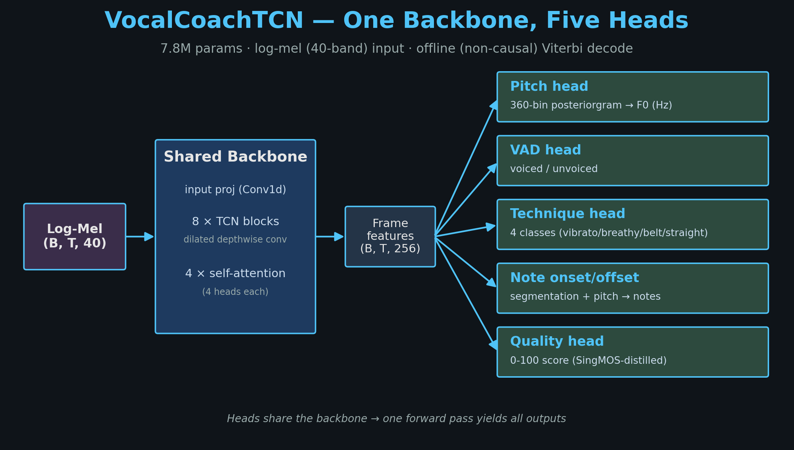

# VocalCoach

Offline singing-analysis system. From a single recording it produces, in one
backbone pass: **pitch** (F0), **voice activity (VAD)**, **singing technique**
(vibrato / breathy / falsetto / belt / straight), **note onsets/offsets**, and a
**quality score** — surfaced in a browser coaching UI.

A 7.8M-parameter TCN backbone (8 temporal-conv blocks + 4 self-attention layers)
feeds five lightweight heads. Technique uses two domain specialists (VocalSet +
GTSinger) fused at inference so all five classes are covered.



---

## 1. Setup

```bash
git clone <THIS-REPO-URL>
cd VocalCoach
python -m venv .venv && source .venv/bin/activate     # Python 3.11+
pip install -r requirements.txt
```

## 2. Get the weights

Checkpoints are committed under `ckpts/`

The demo loads **four checkpoints**:

| Loaded as | Checkpoint | Provides |
|---|---|---|
| **Primary** (`VOCALCOACH_CHECKPOINT`) | `ckpts/tech_vocalset_probe.pth` | backbone **pitch + VAD** + VocalSet technique (vibrato/breathy/belt/straight) |
| +1 (`VOCALCOACH_GTSINGER_CHECKPOINT`) | `ckpts/tech_gtsinger_probe.pth` | GTSinger technique (falsetto) — fused with the primary |
| +1 (`VOCALCOACH_QUALITY_CHECKPOINT`) | `ckpts/quality_v2.pth` | quality head (9-dim expert + 0-100 score) |
| +1 (`VOCALCOACH_NOTE_CHECKPOINT`) | `ckpts/note.pth` | note onset/offset + note-with-pitch |

All four
checkpoints share that one backbone; each adds one head, run as an extra forward pass.

---

## 3. Run the demo (browser UI)

```bash
export VOCALCOACH_CHECKPOINT=ckpts/tech_vocalset_probe.pth             # primary: backbone pitch/VAD + VocalSet technique
export VOCALCOACH_GTSINGER_CHECKPOINT=ckpts/tech_gtsinger_probe.pth    # +1 pass for falsetto
export VOCALCOACH_QUALITY_CHECKPOINT=ckpts/quality_v2.pth             # our quality head (0-100)
export VOCALCOACH_NOTE_CHECKPOINT=ckpts/note.pth                      # +1 pass for note onset/offset (optional)

# Phrase segmentation (musical, not speech). A phrase = a voiced span; a new phrase
# starts after a silence gap >= PHRASE_GAP_MS. Defaults group a full sung line into
# one phrase (the UI also lets the user pick a phrasing mode per upload):
export VOCALCOACH_PHRASE_GAP_MS=500    # silence gap (ms) that starts a new phrase
export VOCALCOACH_PHRASE_MIN_MS=300    # drop phrases shorter than this (ms)

uvicorn src.api:app --host 0.0.0.0 --port 8000
```

Open **http://localhost:8000/ui** and drop an audio file (a few are in
[`samples/`](samples/)). You'll see the waveform + voice activity, pitch
posteriorgram, note timeline, detected technique, per-phrase breakdown (click a
phrase to play just that segment + see its coaching notes), and the overall score.

- Only `VOCALCOACH_CHECKPOINT` is required; the GTSinger and quality vars are
  optional (without them: single-head technique, no falsetto / no learned quality).
- API endpoints: `POST /analyse` (full JSON), `GET /health`.

## 4. Inputs / outputs

**Input:** any singing clip (WAV/MP3/FLAC), 16 kHz mono internally (auto-resampled).

**Output & persistence — the two paths differ:**

- **UI (`POST /sessions/{song}`)** — used by the browser. Every take is **auto-saved**:
  the full report JSON is appended to `{song}.json` and the user (+ optional
  reference) audio is written as WAV, under `VOCALCOACH_SESSIONS_DIR`
  (default `./vocalcoach_sessions/`). Past takes — report *and* audio — can be
  replayed later.
- **`POST /analyse`** — stateless. Returns the report as JSON in the HTTP response
  and writes **nothing** to disk; redirect it yourself if you want to keep it.

Quick CLI test without the UI (note the field is `audio`, not `file`):

```bash
curl -s -F "audio=@your_clip.wav" http://localhost:8000/analyse | python -m json.tool
# save it:
curl -s -F "audio=@your_clip.wav" http://localhost:8000/analyse > your_clip.analysis.json
```

Optional: add `-F "reference=@target.wav"` for DTW + a full report on the reference,
or `-F "phrasing=ballad"` (`default` | `ballad` | `uptempo`) to set phrase grouping.

**Worked example** (committed): [`samples/house.wav`](samples/house.wav) (16 s) and
its full `/analyse` output [`samples/house.analysis.json`](samples/house.analysis.json)
— overall 61/100, 3 phrases, 15 notes, dominant technique = vibrato, quality 70/100.

---

## 5. Reproduce evaluation

```bash
# Pitch / VAD + technique on held-out sets
python vocalcoach/evaluate.py \
    --checkpoint ckpts/tech_vocalset_probe.pth \
    --data-dir data --technique-dir data/vocalset

# Out-of-distribution (Vocadito — never seen in training)
python scripts/evalOOD.py \
    --checkpoint ckpts/stage1_gainaug_spectilt.pth \
    --dataset vocadito --data-dir data/vocadito

# Note onset/offset + note-with-pitch F1
python scripts/evalNoteHead.py \
    --checkpoint ckpts/stage1_gainaug_spectilt.pth \
    --note-npz data/annotated_vocalset/note_test.npz

# Two-head technique fusion (5-class) accuracy
python scripts/evalFusion.py \
    --vocalset-ckpt ckpts/tech_vocalset_probe.pth \
    --gtsinger-ckpt ckpts/tech_gtsinger_probe.pth
```

### Headline results

| Head | Metric | In-dist | OOD (Vocadito) |
|---|---|---|---|
| Pitch | RPA | 99% | 72% |
| VAD | VDR | 88% | 68% |
| Technique | clip-acc | 80.8% (≈ paper SOTA) | — |
| Note | onset F1 | 0.76 | — |

See [`slides/`](slides/) for the full results breakdown.

---

## 6. Data

VocalCoach trains on **public datasets** (we link them; we do not redistribute):

| Use | Dataset | Link |
|---|---|---|
| Pitch / VAD | NanoPitch-PreExtract (126 h, pre-extracted) | https://huggingface.co/datasets/smulelabs/NanoPitch-PreExtract |
| Technique | VocalSet | https://zenodo.org/records/1193957 |
| Technique (falsetto) | GTSinger | https://huggingface.co/datasets/AaronZ345/GTSinger |
| Note labels | Annotated VocalSet | (derived from VocalSet) |
| OOD eval | Vocadito | https://zenodo.org/records/5557945 |
| Quality | SingMOS-Pro / ccmusic / PopBuTFy | (see report) |

Download the pre-extracted pitch/VAD features + eval data:

```bash
python scripts/download_data.py --output-dir data
```

**Augmentation.** All augmentation is applied **on-the-fly at training time** (the
stored features are clean): **gain** (random −40→0 dB, for quiet/feeble recordings),
**spectral-tilt** (random per-band EQ, for mic/room coloration), **noise mixing**
(MUSAN-style at random SNR), and **SpecAugment** (time/freq masking). Pitch-shift and
time-stretch are additionally available as *offline*, label-preserving augmentations
for the technique data (applied to raw audio, with labels re-derived). All are
label-safe — none move onsets/pitch in a way that breaks supervision.

**Quality training data.** Three complementary sources feed the quality head
(pre-extracted by `scripts/prepareQualityData.py`): (1) **SingMOS-Pro** clips with
scalar MOS targets (1–5); (2) **ccmusic** clips with 9-dim expert ratings (pitch,
rhythm, timbre, breath, vibrato, dynamics, pronunciation, range, overall); and
(3) **PopBuTFy** professional-vs-amateur pairs for contrastive ranking — pairs are
matched **by singer × song** (the same singer's professional and amateur take of the
same song, identified by the `_Professional` / `_Amateur` file suffix), so the model
learns *relative* quality (pro should score higher than amateur) independent of song
or singer identity.

---

## 7. Repository layout

```
vocalcoach/          model, heads, training, inference API, browser UI
  ├── model.py         VocalCoachTCN (backbone + 5 heads)
  ├── train.py         training (all heads, augmentation, probes)
  ├── evaluate.py      pitch/VAD/technique eval
  ├── coach.py         frame outputs → coaching report
  ├── api.py           FastAPI demo server + two-head fusion wiring
  ├── technique_fusion.py   VocalSet+GTSinger union/trained fusion
  └── ui/index.html    browser coaching UI
scripts/             eval (OOD, note, fusion), data/weights download, slide gen
ckpts/               deployment checkpoints (download or committed)
slides/              system diagram + results (PNG) + speaker notes
samples/             example audio + expected outputs
data/                downloaded datasets (gitignored)
requirements.txt     pinned dependencies
```

---

## Training (optional — to reproduce from scratch)

The deployment backbone is a gain + spectral-tilt finetune; technique/note/quality
heads are trained as VAD-preserving probes on top of it. Example (VocalSet
technique probe):

```bash
python vocalcoach/train.py \
    --data-dir data --technique-dirs data/vocalset_aug \
    --arch tcn --hidden 256 --n-blocks 8 --n-attn-layers 4 --n-heads 4 \
    --probe-mode --deep-technique-head --w-technique 1.5 \
    --augment noise_specaug --gain-aug-db 40 --spec-tilt-db 8 \
    --save-best-only --epochs 60 --patience 20 \
    --resume ckpts/stage1_gainaug_spectilt.pth \
    --output-dir vocalcoach/runs/tech_vocalset_probe
```

Re-extracting features from raw audio additionally requires RMVPE (not pip; see
`requirements.txt` notes).
